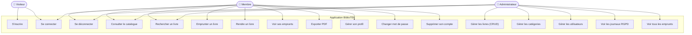

# Diagramme de cas d'utilisation — BiblioTEK

```mermaid
flowchart TD
    Visiteur(["👤 Visiteur"])
    Membre(["👤 Membre"])
    Admin(["👤 Administrateur"])

    subgraph Application BiblioTEK
        UC1["S'inscrire"]
        UC2["Se connecter"]
        UC3["Se déconnecter"]
        UC4["Consulter le catalogue"]
        UC5["Rechercher un livre"]
        UC6["Emprunter un livre"]
        UC7["Rendre un livre"]
        UC8["Voir ses emprunts"]
        UC9["Exporter PDF"]
        UC10["Gérer son profil"]
        UC11["Changer mot de passe"]
        UC12["Supprimer son compte"]
        UC13["Gérer les livres (CRUD)"]
        UC14["Gérer les catégories"]
        UC15["Gérer les utilisateurs"]
        UC16["Voir les journaux RGPD"]
        UC17["Voir tous les emprunts"]
    end

    Visiteur --> UC1
    Visiteur --> UC2

    Membre --> UC2
    Membre --> UC3
    Membre --> UC4
    Membre --> UC5
    Membre --> UC6
    Membre --> UC7
    Membre --> UC8
    Membre --> UC9
    Membre --> UC10
    Membre --> UC11
    Membre --> UC12

    Admin --> UC3
    Admin --> UC4
    Admin --> UC5
    Admin --> UC13
    Admin --> UC14
    Admin --> UC15
    Admin --> UC16
    Admin --> UC17
```
