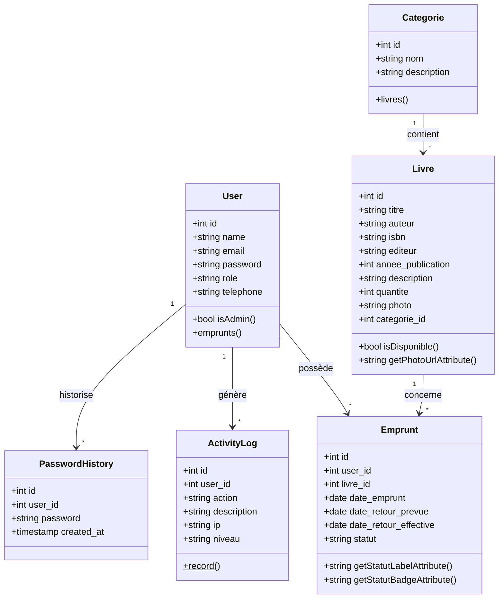

# Diagramme de classes — BiblioTEK

```mermaid
classDiagram
    class User {
        +int id
        +string name
        +string email
        +string password
        +string role
        +string telephone
        +bool isAdmin()
        +emprunts()
    }

    class Livre {
        +int id
        +string titre
        +string auteur
        +string isbn
        +string editeur
        +int annee_publication
        +string description
        +int quantite
        +string photo
        +int categorie_id
        +bool isDisponible()
        +string getPhotoUrlAttribute()
    }

    class Emprunt {
        +int id
        +int user_id
        +int livre_id
        +date date_emprunt
        +date date_retour_prevue
        +date date_retour_effective
        +string statut
        +string getStatutLabelAttribute()
        +string getStatutBadgeAttribute()
    }

    class Categorie {
        +int id
        +string nom
        +string description
        +livres()
    }

    class ActivityLog {
        +int id
        +int user_id
        +string action
        +string description
        +string ip
        +string niveau
        +record()$
    }

    class PasswordHistory {
        +int id
        +int user_id
        +string password
        +timestamp created_at
    }

    User "1" --> "*" Emprunt : possède
    User "1" --> "*" ActivityLog : génère
    User "1" --> "*" PasswordHistory : historise
    Livre "1" --> "*" Emprunt : concerne
    Categorie "1" --> "*" Livre : contient
```
