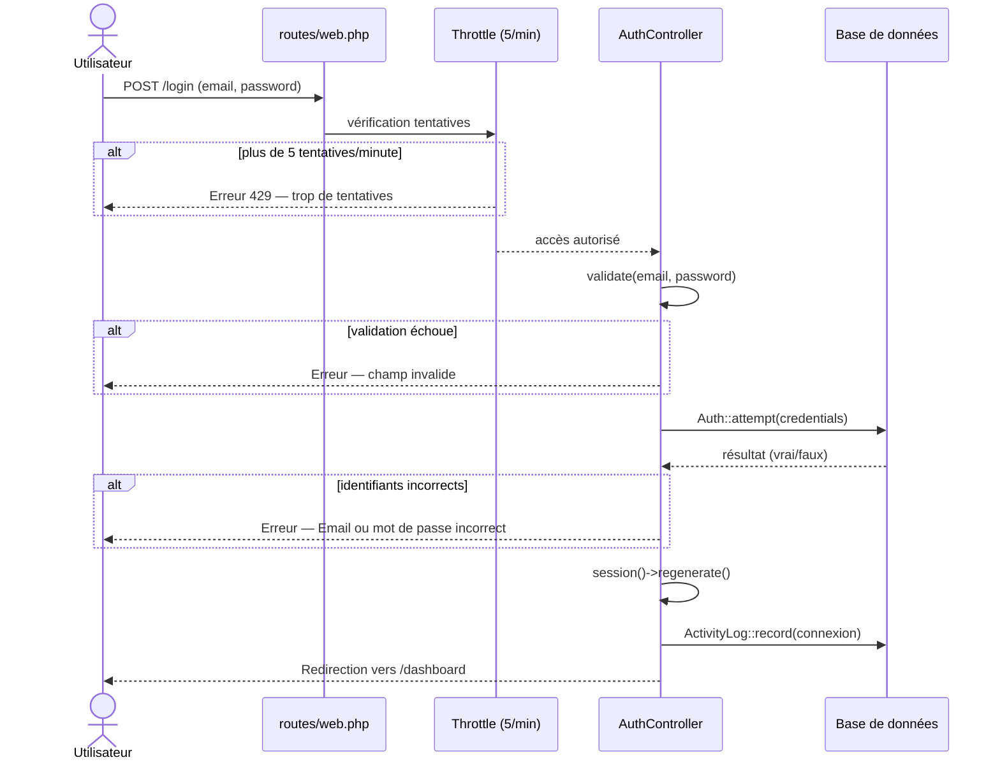

# Diagramme de séquence — Connexion

```mermaid
sequenceDiagram
    actor Utilisateur
    participant Route as routes/web.php
    participant TH as Throttle (5/min)
    participant AC as AuthController
    participant BDD as Base de données

    Utilisateur->>Route: POST /login (email, password)
    Route->>TH: vérification tentatives
    alt plus de 5 tentatives/minute
        TH-->>Utilisateur: Erreur 429 — trop de tentatives
    end

    TH-->>AC: accès autorisé
    AC->>AC: validate(email, password)
    alt validation échoue
        AC-->>Utilisateur: Erreur — champ invalide
    end

    AC->>BDD: Auth::attempt(credentials)
    BDD-->>AC: résultat (vrai/faux)

    alt identifiants incorrects
        AC-->>Utilisateur: Erreur — Email ou mot de passe incorrect
    end

    AC->>AC: session()->regenerate()
    AC->>BDD: ActivityLog::record(connexion)
    AC-->>Utilisateur: Redirection vers /dashboard
```
