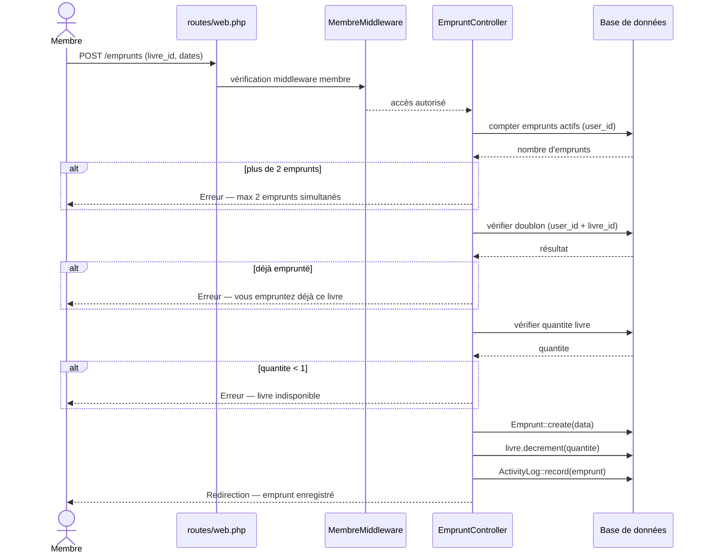

# Diagramme de séquence — Emprunt d'un livre

```mermaid
sequenceDiagram
    actor Membre
    participant Route as routes/web.php
    participant MW as MembreMiddleware
    participant EC as EmpruntController
    participant BDD as Base de données

    Membre->>Route: POST /emprunts (livre_id, dates)
    Route->>MW: vérification middleware membre
    MW-->>EC: accès autorisé

    EC->>BDD: compter emprunts actifs (user_id)
    BDD-->>EC: nombre d'emprunts
    alt plus de 2 emprunts
        EC-->>Membre: Erreur — max 2 emprunts simultanés
    end

    EC->>BDD: vérifier doublon (user_id + livre_id)
    BDD-->>EC: résultat
    alt déjà emprunté
        EC-->>Membre: Erreur — vous empruntez déjà ce livre
    end

    EC->>BDD: vérifier quantite livre
    BDD-->>EC: quantite
    alt quantite < 1
        EC-->>Membre: Erreur — livre indisponible
    end

    EC->>BDD: Emprunt::create(data)
    EC->>BDD: livre.decrement(quantite)
    EC->>BDD: ActivityLog::record(emprunt)
    EC-->>Membre: Redirection — emprunt enregistré
```
