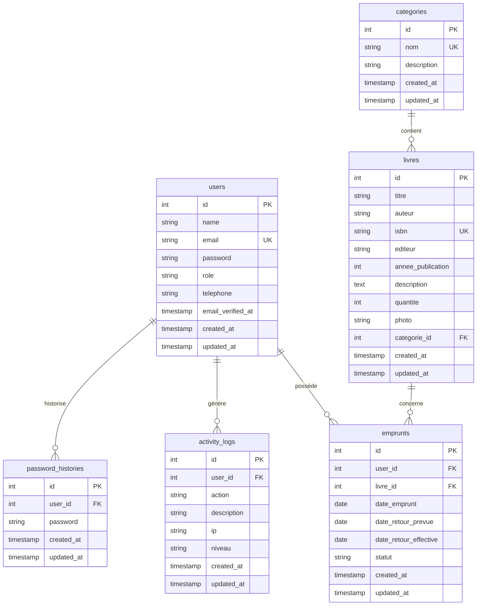

# Schéma de la base de données — BiblioTEK

```mermaid
erDiagram
    users {
        int id PK
        string name
        string email UK
        string password
        string role
        string telephone
        timestamp email_verified_at
        timestamp created_at
        timestamp updated_at
    }

    categories {
        int id PK
        string nom UK
        string description
        timestamp created_at
        timestamp updated_at
    }

    livres {
        int id PK
        string titre
        string auteur
        string isbn UK
        string editeur
        int annee_publication
        text description
        int quantite
        string photo
        int categorie_id FK
        timestamp created_at
        timestamp updated_at
    }

    emprunts {
        int id PK
        int user_id FK
        int livre_id FK
        date date_emprunt
        date date_retour_prevue
        date date_retour_effective
        string statut
        timestamp created_at
        timestamp updated_at
    }

    activity_logs {
        int id PK
        int user_id FK
        string action
        string description
        string ip
        string niveau
        timestamp created_at
        timestamp updated_at
    }

    password_histories {
        int id PK
        int user_id FK
        string password
        timestamp created_at
        timestamp updated_at
    }

    users ||--o{ emprunts : "possède"
    users ||--o{ activity_logs : "génère"
    users ||--o{ password_histories : "historise"
    livres ||--o{ emprunts : "concerne"
    categories ||--o{ livres : "contient"
```
